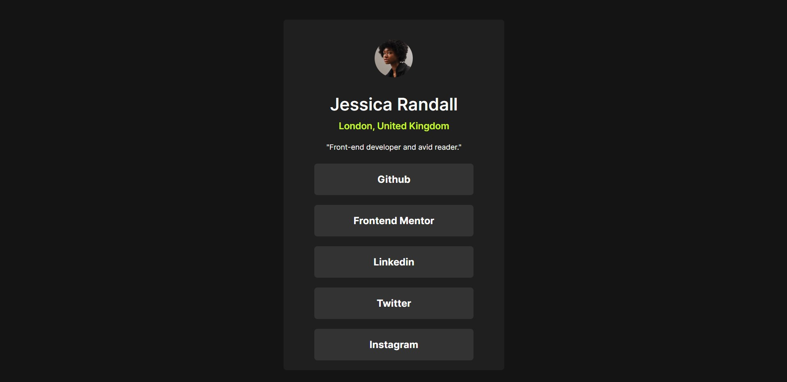

# Frontend Mentor - Social links profile solution

This is a solution to the [Social links profile challenge on Frontend Mentor](https://www.frontendmentor.io/challenges/social-links-profile-UG32l9m6dQ).Frontend Mentor challenges help you improve your coding skills by building realistic projects

# Screenshot

# Links

- Solution URL: [Click here](#)
- Live Site URL: [Click here](#)

# Build with

- HTML
- CSS

# What I learned

- Implement css variables
- Avoiding px and using rem
